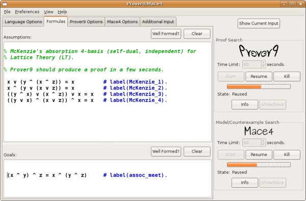
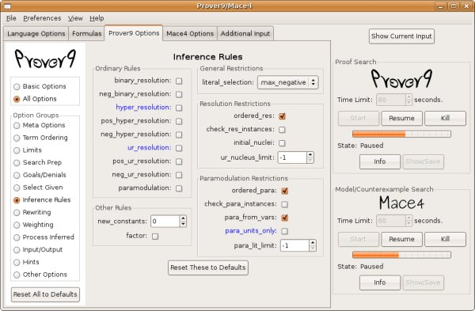

# Prover9-Mace4 v05

The Prover9-Mace4 GUI uses version LADR-Dec-2007 of Prover9 and Mace4. If you need a more recent verion of Prover9 or Mace4, you'll have to use a [command-line version](https://github.com/laitep/ladr).

---

  

---

  

---

- This is a Graphical User Interface for [Prover9 and Mace4](http://www.cs.unm.edu/~mccune/prover9/).
- It was constructed with Python and the WX widget library.
- The target platforms are Windows (2000 or later), Mac OS X (10.3.9 or later), and Linux.
- To get started:
  - Install the GUI (see the following sections).
  - Start the GUI and see "File->Sample Inputs" and "[Help](docs/v05-help.txt)".
  - See the Prover9/Mace4 [Manual](http://www.cs.unm.edu/~mccune/prover9/manual/Dec-2007/) and [Examples](http://www.cs.unm.edu/~mccune/prover9/examples/Dec-2007/).
- The GUI contains Prover9 and Mace4, so there is no need to also install the LADR system.

---

## Windows

Download: [Prover9-Mace4-v05-setup.exe](https://github.com/laitep/Prover9-Mace4-v05/releases/download/v1.0.0/Prover9-Mace4-v05-setup.exe) (about 5.2 MB)

- This will lead you through a standard Windows installation. (You have to be an administrator.)

### Known Windows Problems

- When both Prover9 and Mace4 are running, the GUI response is slow.
- Automatic syntax highlighting is annoying, so it is disabled on startup.
- If you try to start the GUI and you see an error message that the dll MSVCP71.DLL is missing, you can download it here: [MSVCP71.DLL](https://github.com/laitep/Prover9-Mace4-v05/releases/download/v1.0.0/MSVCP71.DLL), and then place it in the directory "C:\\Program Files\\Prover9-Mace4".

---

## Macintosh (32-bit Intel)

Download: [Prover9-Mace4-v05B.zip](https://github.com/laitep/Prover9-Mace4-v05/releases/download/v1.0.0/Prover9-Mace4-v05B-macOSx86.zip) (about 9.2 MB)

- If you put this on your Desktop and open (unzip) it, the Prover9-Mace4 app should appear on your Desktop.

### Known Mac Problems

- NOTE (March 14, 2008): There is a bug in the December 2007 version (Prover9-Mace4-v05.zip), which caused changes in the parameters (max_seconds, etc.) to not be sent to Prover9 or Mace4. Version v05B contains a fix. This problem does not occur in the Linux or Windows versions.
- On an old iBook (G3 with 10.3.9), the text boxes that contain a lot of output (>32K?) don't show scrollbars. All of the text really is there, so it can be 'Save'd. This problem did not occur on the Intel Macs (10.4, 10.5) we used for testing.

---

## Linux

Download: [p9m4-v05.tar.gz](https://github.com/laitep/Prover9-Mace4-v05/releases/download/v1.0.0/p9m4-v05.tar.gz) (about 1.7 MB)

- This is _not_ a self-contained package like the Windows and Mac versions.
- You'll need Python 2.5 (or later) and Python-wxgtk2.6 (or later).
- In Ubuntu, you can install packages python2.5 and python-wxgtk2.6.
- Unpack p9m4-v05.tar.gz and run p9m4-v05/prover9-mace4.py.

### Known Linux Problems

- If startup fails with an error "OverflowError: argument number 7: value -9223372036854775807 is less than 'int' minimum -2147483648", it is caused by a bug in wxPython 64-bit systems. To get around the bug, insert the following line in the file options.py at line 30.

  sys.maxint = 2147483647 # avoids bug in wx.SpinCtrl on 64-bit systems

- The included prover binaries (prover9, prooftrans, mace4, interpformat, isofilter, isofilter2) are compiled for i386. If you have different hardware, you can fetch [LADR-2009-11A.tar.gz](https://github.com/laitep/ladr/releases/download/v1.0.0/LADR-2009-11A.tar.gz), compile, and replace those 6 binaries in the directory p9m4-v04/bin.
